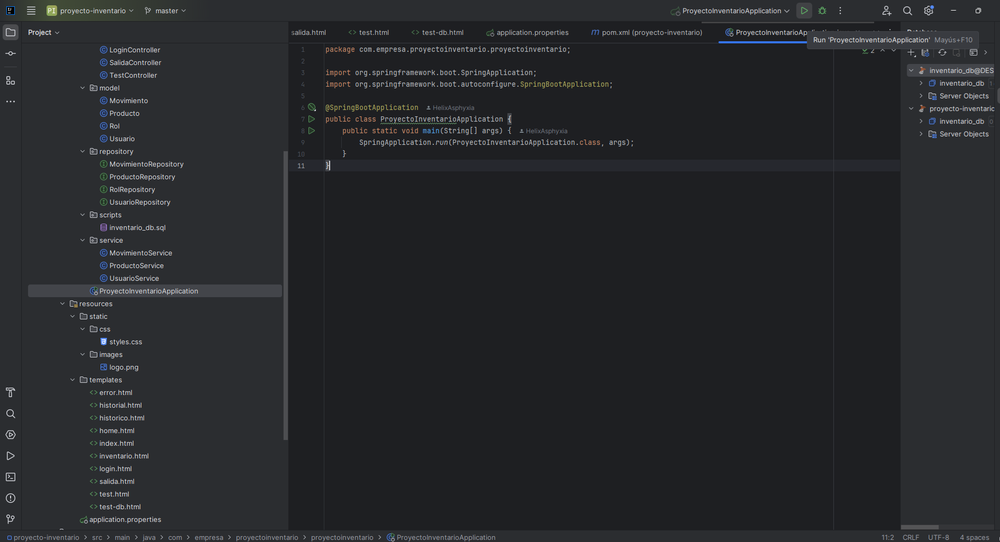

# Inventario - Sistema de Gestión Profesional

## 🌟 Bienvenido
Bienvenido al repositorio del proyecto **Inventario**, un sistema robusto y elegante desarrollado para gestionar inventarios personales con tecnología de punta. Este proyecto, creado el 5 de marzo de 2025, utiliza **Spring Boot 3.4.3**, **Maven**, **Java 17**, y **SQL Server** con **SQL Server Management Studio 2022**, ofreciendo una solución moderna y escalable.

---

## 📋 Estructura del Repositorio
| Carpeta/Archivo         | Descripción                                      |
|--------------------------|--------------------------------------------------|
| `SCRIPTS/`              | Contiene scripts (ej. SQL) para la configuración de la base de datos. |
| `README.md`             | Este archivo, tu guía definitiva para el proyecto. |
| `src/main/resources/application.properties` | Configuración de la base de datos y la aplicación. |
| `pom.xml`               | Archivo de configuración de Maven. |

---

## 🛠️ Detalles Técnicos

### IDE Utilizado
- **IntelliJ IDEA**: ultima version.

### Lenguaje de Programación
- **Java**: version "22.0.1" 2024-04-16
Java(TM) SE Runtime Environment (build 22.0.1+8-16)
Java HotSpot(TM) 64-Bit Server VM (build 22.0.1+8-16, mixed mode, sharing).

### Sistema de Gestión de Base de Datos
- **SQL Server Management Studio 2022**: Versión Microsoft SQL Server 2022 (RTM) - 16.0.1000.6 (X64)
- **Configuración de Conexión**:
  - Correr el script que se encuentra en: 
    ```bash
     \proyecto-inventario\src\main\java\com\empresa\proyectoinventario\proyectoinventario\scripts\
- Nombre del script: inventario_db.sql
- Nombre del script para otro punto de la evaluacion: ConsultasDB.sql
### Herramientas de Desarrollo
- **Maven**.
- **Spring Boot**.
- **Spring Framework**.
- **Spring Security**.
- **JDBC Driver para SQL Server**: Versión 12.8.1.jre11 (definida en `pom.xml`).

---

## 🚀 Cómo Correr la Aplicación

### Pasos Detallados
1. **Clona el Repositorio**  
   - Ejecuta en tu terminal:
     ```bash
     git clone https://github.com/HelixAsphyxia/Inventario.git
2. **Clona el Repositorio**  
   - Ve al directorio del proyecto, posicionate dentro de:
     ```bash
     proyecto-inventario\src\main\java\com\empresa\proyectoinventario\proyectoinventario
   - Corre este archivo llamado: ProyectoInventarioApplication.java

## Visualiza mi video!

Anexo drive para visualizar la explicacion de la prueba tecnica.

https://drive.google.com/file/d/1FCePusXPKr-9BtqLrCmvs25nWrCYS1kg/view?usp=drive_link

- Corre este archivo llamado: ProyectoInventarioApplication.java

### ✨ Características Destacadas
Arquitectura modular con Spring Boot 3.4.3.
Integración segura con SQL Server y logging detallado.
Interfaz dinámica con Thymeleaf y seguridad con Spring Security 6.4.3.
### 📝 Notas Importantes

El diagrama esta anexado a la raiz del proyecto.

Agradezco la oportunidad y el tiempo :D
   
