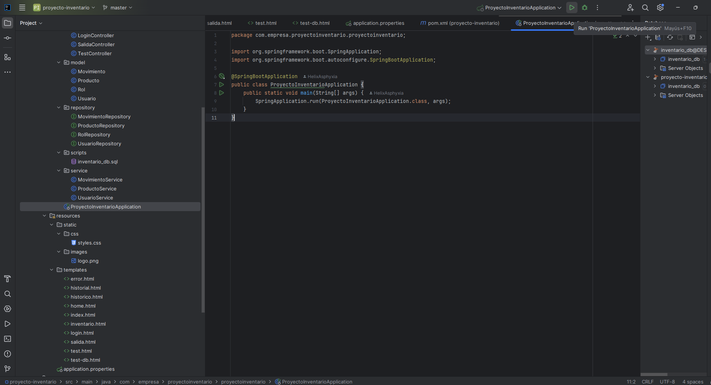

# Inventario - Sistema de Gestión Profesional

## 🌟 Bienvenido
Bienvenido al repositorio del proyecto **Inventario**, un sistema robusto y elegante desarrollado para gestionar inventarios personales con tecnología de punta. Este proyecto, creado el 5 de marzo de 2025, utiliza **Spring Boot 3.4.3**, **Maven**, **Java 17**, y **SQL Server** con **SQL Server Management Studio 2022**, ofreciendo una solución moderna y escalable.

---

## 📋 Estructura del Repositorio
| Carpeta/Archivo         | Descripción                                      |
|--------------------------|--------------------------------------------------|
| `SCRIPTS/`              | Contiene scripts (ej. SQL) para la configuración de la base de datos. |
| `logo/`                 | Almacena el logo y la imagen guía para ejecutar la aplicación. |
| `README.md`             | Este archivo, tu guía definitiva para el proyecto. |
| `src/main/resources/application.properties` | Configuración de la base de datos y la aplicación. |
| `pom.xml`               | Archivo de configuración de Maven. |

---

## 🛠️ Detalles Técnicos

### IDE Utilizado
- **IntelliJ IDEA**: Versión [Inserta versión, ej. 2023.2.1] (verifica en `Help > About`).

### Lenguaje de Programación
- **Java**: Versión 17 (verificado con `java -version`).

### Sistema de Gestión de Base de Datos
- **SQL Server Management Studio 2022**: Versión [Inserta versión, ej. 19.0.2.0] (verifica en `Help > About` o con `SELECT @@VERSION`).
- **Configuración de Conexión**:
  - URL: `jdbc:sqlserver://DESKTOP-ID69N8S\\MSSQLSERVER:1433;databaseName=inventario_db;encrypt=false;trustServerCertificate=true`
  - Usuario: `sa`
  - Contraseña: `37510`
  - Driver: `com.microsoft.sqlserver.jdbc.SQLServerDriver`

### Herramientas de Desarrollo
- **Maven**.
- **Spring Boot**.
- **Spring Framework**.
- **Spring Security**.
- **JDBC Driver para SQL Server**: Versión 12.8.1.jre11 (definida en `pom.xml`).

---

## 🚀 Cómo Correr la Aplicación

### Pasos Detallados
1. **Clona el Repositorio**  
   - Ejecuta en tu terminal:
     ```bash
     git clone https://github.com/HelixAsphyxia/Inventario.git
2. **Clona el Repositorio**  
   - Ve al directorio del proyecto, posicionate dentro de:
     ```bash
     proyecto-inventario\src\main\java\com\empresa\proyectoinventario\proyectoinventario
   - Corre este archivo llamado: ProyectoInventarioApplication.java

### ✨ Características Destacadas
Arquitectura modular con Spring Boot 3.4.3.
Integración segura con SQL Server y logging detallado.
Interfaz dinámica con Thymeleaf y seguridad con Spring Security 6.4.3.
### 📝 Notas Importantes
Fecha de Creación: 05/03/2025.
Autenticación en Git: Usa un Personal Access Token (PAT) generado en GitHub > Settings > Developer settings.
Soporte: Contacta al desarrollador en el perfil HelixAsphyxia.
Seguridad: Mantén la contraseña 37510 segura y considera usar variables de entorno en producción.
   
